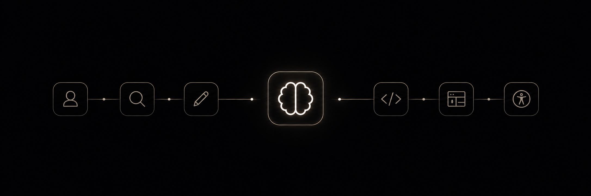

# 

# 🎨 Design Skills Repository

Una colección abierta de skills para diseñadores que buscan crear mejores productos, tomar mejores decisiones y potenciar su trabajo con metodologías, buenas prácticas e inteligencia artificial.


## ✨ ¿Qué es este repositorio?

Este repositorio nace de una idea muy sencilla: compartir conocimiento útil para que más diseñadores puedan crear mejores productos digitales.

Aquí encontrarás una colección de **skills documentadas en formato Markdown**, pensadas para ser consultadas, reutilizadas y adaptadas libremente según las necesidades de cada proyecto.

El objetivo no es reemplazar el criterio profesional ni ofrecer fórmulas mágicas. Cada skill busca servir como una herramienta práctica que te ayude a abordar problemas de diseño desde diferentes perspectivas, aportando procesos, marcos de trabajo y conocimientos aplicables al mundo real.


## 🧩 ¿Qué tipo de skills encontrarás?

Dentro del repositorio podrás encontrar habilidades relacionadas con:

- UX Research
- Diseño de interfaces (UI)
- Design Systems
- Accesibilidad
- Arquitectura de información
- Estrategia de producto
- Heurísticas de Nielsen Norman Group
- UX Writing
- Inteligencia Artificial aplicada al diseño
- Procesos de descubrimiento y validación
- Y otras áreas relacionadas con la creación de productos digitales


## Integración de Skills

### Claude Code

#### Ubicación

```text
.claude/
└── skills/
    ├── ui-exploration-architect/
    ├── accessibility-reviewer/
    └── product-strategist/
```

#### Invocación

```text
Usa la skill UI Exploration Architect para rediseñar esta pantalla.
```

```text
Aplica Accessibility Reviewer sobre este flujo.
```

---

### Cursor

#### Ubicación

```text
.ai/
└── skills/
    ├── ui-exploration-architect.md
    ├── accessibility-reviewer.md
    └── product-strategist.md
```

o

```text
.cursor/
└── rules/
```

#### Invocación

```text
Usa UI Exploration Architect para generar alternativas.
```

```text
Aplica Design System Guardian antes de proponer cambios.
```

---

### Gemini IDE

#### Ubicación

```text
.ai/
└── skills/
```

o

```text
.gemini/
```

#### Invocación

```text
Usa Product Strategist para analizar este requerimiento.
```

```text
Aplica UX Researcher para identificar oportunidades.
```

---

# Estructura Recomendada

```text
.ai/
│
├── skills/
│   ├── product-strategist.md
│   ├── ux-researcher.md
│   ├── ui-exploration-architect.md
│   ├── accessibility-reviewer.md
│   ├── design-system-guardian.md
│   └── frontend-reviewer.md
│
├── templates/
├── frameworks/
└── references/
```

## 🌱 Filosofía del proyecto

Creo que el conocimiento crece cuando se comparte.

Por eso este repositorio está pensado como una biblioteca abierta de habilidades, construida para que cualquier diseñador pueda aprender, experimentar, adaptar procesos y descubrir nuevas formas de resolver problemas.

Toma lo que necesites, combínalo con tu experiencia y utilízalo para construir mejores productos.


## 🚀 Cómo empezar

1. Explora las categorías disponibles.
2. Encuentra la skill que mejor se adapte a tu necesidad.
3. Léela, entiéndela y adáptala a tu contexto.
4. Aplícala en tu proyecto.
5. Itera y mejora.


## 🤝 Cómo contribuir

¿Tienes una skill que podría ayudar a otros diseñadores?

Las contribuciones son más que bienvenidas. Si deseas aportar una nueva skill o mejorar una existente, simplemente:
>Abre un **Pull Request (PR)** describiendo brevemente:
   - Qué agrega o mejora tu contribución.
   - Qué problema ayuda a resolver.
   - En qué contexto puede utilizarse.

Procura mantener el contenido claro, práctico y fácil de aplicar para que cualquier diseñador pueda aprovecharlo.

Toda contribución, por pequeña que sea, ayuda a fortalecer esta biblioteca de conocimiento para la comunidad.

<div align="center">

☀️ **Contribuido con cariño desde tierra caliente, Cartagena, Colombia.**

</div>
